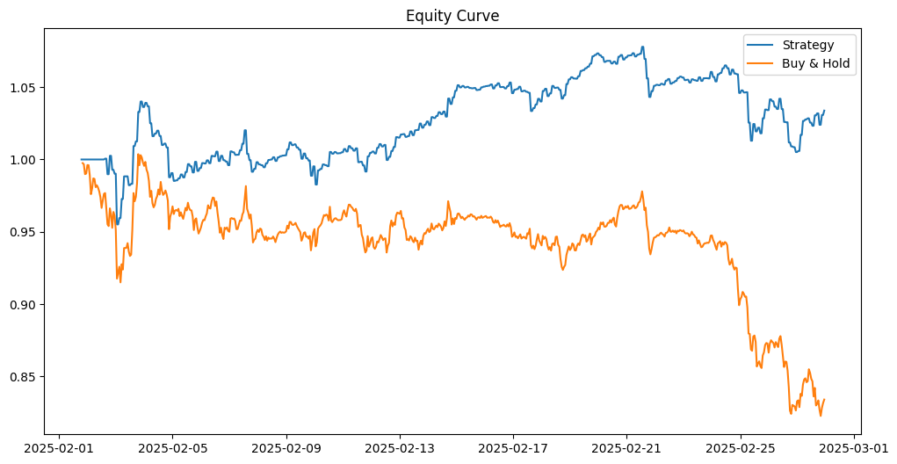

# Bitcoin Mean Reversion Trading Strategy

This Jupyter Notebook implements a Bitcoin trading strategy based on mean reversion using Python.

## Overview

This project uses a 20-hour Simple Moving Average (SMA) and volatility (4 standard deviations) to identify trading opportunities for Bitcoin (BTC-USD). The notebook includes data fetching, strategy logic, back-testing, and performance metrics like Sharpe Ratio. 

## Trading Strategy Explanation
This strategy uses a simple rule-based system to generate trading signals based on dynamic price bands. It is designed to identify potential entry and exit points by comparing the current closing price against the calculated bands.

Key Components
1- Price Bands:
The strategy uses two bands:

Lower Band: Acts as a potential support level.
Upper Band: Serves as a potential resistance level.
Signals:

2- Buy Signal:
A buy (or long) signal is generated when the Bitcoin closing price is above the lower band and no position is currently held. The rationale is that a price above the lower band may indicate that the price is recovering from lower levels and could be poised for an upward move.

3- Sell Signal:
A sell (or exit) signal is triggered when the closing price drops below the upper band while holding a position. This suggests that the price might be weakening relative to the resistance level, prompting an exit from the trade.

Position Management:
The strategy uses a binary position system:

0 indicates no current position (flat).
1 indicates that a long position is held.

## Setup

Please ensure you using Python 3 or later.

```
python3 --version
```

### Clone repo

```
git clone https://github.com/Algo_Trading.git
$ cd Algo_Trading
```

### Create an environment and install dependencies

### Mac/Linux/WSL

```
$ python3 -m venv algo_env
$ source algo_env/bin/activate
$ pip insall -r requirment.txt
```

## Results

Total Return: 3.38%

Sharpe Ratio: 0.22

Maximum Drawdown: -6.75%

Number of Trades: 305


